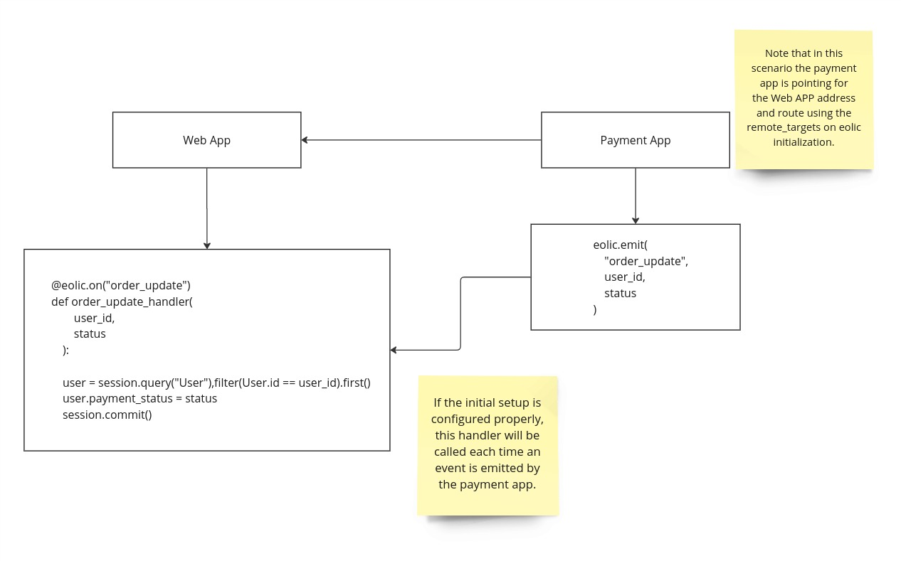

# Usage

## Initializing Eolic

To start using Eolic, create an instance of `Eolic` with an optional list of remote targets.

```python
from eolic import Eolic

driver = Eolic(
    remote_targets=[
        {"type": "url", "address": "https://webhook.site/test-url", "headers": {"X-Api-Key":"test"}, "events": ["ON_CONNECT"]}
    ]
)
```

## Registering Event Listeners

You can register event listeners using the `@driver.on` decorator.

```python
@driver.on("ON_REGISTER")
def register_event(*args, **kwargs):
    print("Register Event", args, kwargs)
```

You can also register listeners manually using the `register_listener` method.

```python
def custom_listener(*args, **kwargs):
    print("Custom Listener", args, kwargs)

driver.register_listener("ON_CUSTOM_EVENT", custom_listener)
```

## Emitting Events

Emit events using the `emit` method.

```python
driver.emit("ON_REGISTER", "user_id", "user_email", "user_password")
```

## Remote Targets

Eolic supports sending events to remote targets like webhooks. Define remote targets when initializing Eolic.

```python
driver = Eolic(
    remote_targets=[
        {"type": "url", "address": "https://webhook.site/test-url", "headers": {"X-Api-Key":"test"}, "events": ["ON_CONNECT"]}
    ]
)
```

## Example: RPG Game

Here's an example of how to use Eolic in an RPG game context.

### Define Your Events

```python
from enum import Enum

class GameEvents(Enum):
    ON_PLAYER_JOIN = "ON_PLAYER_JOIN"
    ON_PLAYER_ATTACK = "ON_PLAYER_ATTACK"
    ON_MONSTER_DEFEATED = "ON_MONSTER_DEFEATED"
    ON_GAME_OVER = "ON_GAME_OVER"
```

### Initialize Eolic

```python
from eolic import Eolic

game_event_handler = Eolic(remote_targets=[
    {"type": "url", "address": "https://webhook.site/test-url", "headers": {"X-Api-Key":"test"}, "events": [GameEvents.ON_MONSTER_DEFEATED]}
])
```

### Register Event Listeners

```python
@game_event_handler.on(GameEvents.ON_PLAYER_JOIN)
def handle_player_join(player_name):
    print(f"{player_name} has joined the game!")

@game_event_handler.on(GameEvents.ON_PLAYER_ATTACK)
def handle_player_attack(player_name, monster_name, damage):
    print(f"{player_name} attacked {monster_name} for {damage} damage!")

@game_event_handler.on(GameEvents.ON_MONSTER_DEFEATED)
def handle_monster_defeated(player_name, monster_name):
    print(f"{player_name} has defeated {monster_name}!")

@game_event_handler.on(GameEvents.ON_GAME_OVER)
def handle_game_over():
    print("Game Over! Thanks for playing.")
```

### Emit Events

```python
# Emitting player join event
game_event_handler.emit(GameEvents.ON_PLAYER_JOIN, "Archer")

# Emitting player attack event
game_event_handler.emit(GameEvents.ON_PLAYER_ATTACK, "Archer", "Goblin", 30)

# Emitting monster defeated event
game_event_handler.emit(GameEvents.ON_MONSTER_DEFEATED, "Archer", "Goblin")

# Emitting game over event
game_event_handler.emit(GameEvents.ON_GAME_OVER)
```


## Integrations

### How it works

Our integration system is responsible for triggering our handler functions from other apps in your ecosystem (most useful for microservices architecture).



For now, we only support FastAPI Integration. However, you can write any integration using the [Integration](../eolic/integrations/base.py) abstract class.

*It's on our roadmap to create more integrations.*

### FastAPI

#### Installation

To use the FastAPI integration, you need to install the necessary dependencies. You can install them using pip:

```bash
pip install eolic[fastapi]
```

#### Initialization

Here's how you can initialize a FastAPI app and the Eolic FastAPI integration:

```python
from fastapi import FastAPI
from eolic import Eolic
from eolic.integrations.fastapi_integration import FastAPIIntegration

# Create an instance of FastAPI
app = FastAPI()

# Create an instance of Eolic
eolic = Eolic()
```

## Setup
Calling the setup method adds a route with the default path ```/event```.

```python
# Create an instance of FastAPIIntegration
fastapi_integration = FastAPIIntegration(app, event_route="/my-custom-event-route")

# Set up the integration
eolic.setup_integration(fastapi_integration)

@eolic.on("my-event"):
def my_event_handler(*args, **kwargs):
    print("My e]vent received with")
    print("ARGS:")
    print(args)
    print("KWARGS:")
    print(kwargs)
```

It's done! Now, any event with the name ```my-event``` emitted from another app with an Eolic instance that contains a ```url``` remote target as **type** and ```http://host/my-custom-event-route``` as **address** will trigger the ```my_event_handler``` handler.
